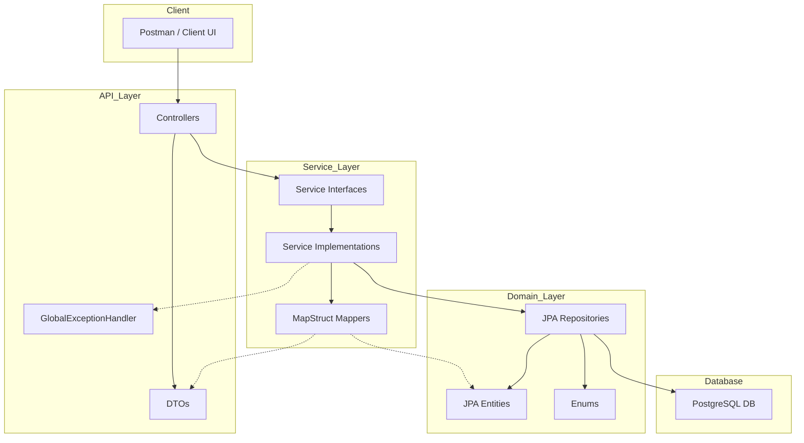

# Arquitectura por Capas y Componentes

Este diagrama muestra cómo interactúan las capas del sistema y las tecnologías involucradas.

```mermaid
graph TD
    subgraph Client
        UI[Postman / Client UI]
    end

    subgraph API_Layer
        Controller[Controllers]
        DTO[DTOs]
        Exception[GlobalExceptionHandler]
    end

    subgraph Service_Layer
        Service[Service Implementations]
        Interface[Service Interfaces]
        Mapper[MapStruct Mappers]
    end

    subgraph Domain_Layer
        Entity[JPA Entities]
        Repo[JPA Repositories]
        Enum[Enums]
    end

    subgraph Database
        Postgres[PostgreSQL DB]
    end

    UI --> Controller
    Controller --> DTO
    Controller --> Interface
    Interface --> Service
    Service --> Mapper
    Service --> Repo
    Mapper -.-> DTO
    Mapper -.-> Entity
    Repo --> Entity
    Repo --> Enum
    Repo --> Postgres
    Service -.-> Exception
```
