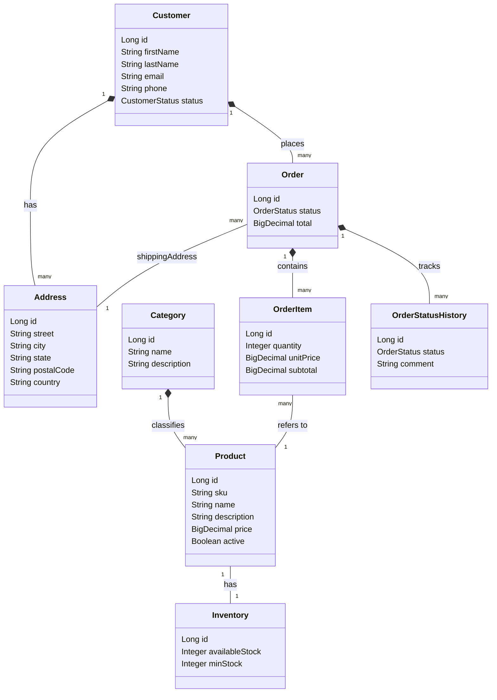

# Diagrama de Clases (Dominio)

Este diagrama muestra las entidades JPA y sus relaciones de cardinalidad.

```mermaid
classDiagram
    class Customer {
        Long id
        String firstName
        String lastName
        String email
        String phone
        CustomerStatus status
    }
    class Address {
        Long id
        String street
        String city
        String state
        String postalCode
        String country
    }
    class Category {
        Long id
        String name
        String description
    }
    class Product {
        Long id
        String sku
        String name
        String description
        BigDecimal price
        Boolean active
    }
    class Inventory {
        Long id
        Integer availableStock
        Integer minStock
    }
    class Order {
        Long id
        OrderStatus status
        BigDecimal total
    }
    class OrderItem {
        Long id
        Integer quantity
        BigDecimal unitPrice
        BigDecimal subtotal
    }
    class OrderStatusHistory {
        Long id
        OrderStatus status
        String comment
    }

    Customer "1" *-- "many" Address : has
    Customer "1" *-- "many" Order : places
    Category "1" *-- "many" Product : classifies
    Product "1" -- "1" Inventory : has
    Order "1" *-- "many" OrderItem : contains
    Order "1" *-- "many" OrderStatusHistory : tracks
    OrderItem "many" -- "1" Product : refers to
    Order "many" -- "1" Address : shippingAddress
```
