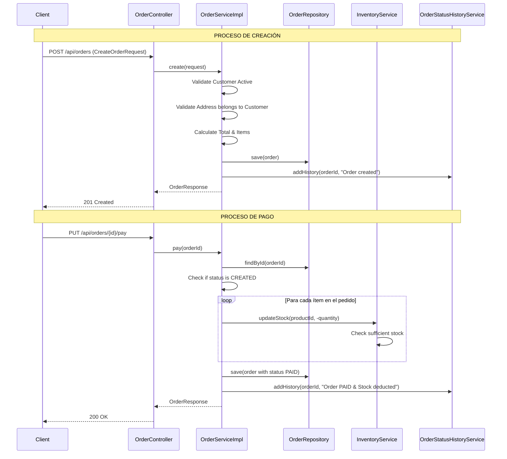

# Diagrama de Secuencia (Creación y Pago de Pedido)

Este flujo muestra las interacciones entre los componentes al crear y pagar una orden, incluyendo las reglas de negocio de stock y estado.

```mermaid
sequenceDiagram
    participant Client
    participant Controller as OrderController
    participant Service as OrderServiceImpl
    participant Repo as OrderRepository
    participant Inv as InventoryService
    participant History as OrderStatusHistoryService

    Note over Client, History: PROCESO DE CREACIÓN
    Client->>Controller: POST /api/orders (CreateOrderRequest)
    Controller->>Service: create(request)
    Service->>Service: Validate Customer Active
    Service->>Service: Validate Address belongs to Customer
    Service->>Service: Calculate Total & Items
    Service->>Repo: save(order)
    Service->>History: addHistory(orderId, "Order created")
    Service-->>Controller: OrderResponse
    Controller-->>Client: 201 Created

    Note over Client, History: PROCESO DE PAGO
    Client->>Controller: PUT /api/orders/{id}/pay
    Controller->>Service: pay(orderId)
    Service->>Repo: findById(orderId)
    Service->>Service: Check if status is CREATED
    loop Para cada ítem en el pedido
        Service->>Inv: updateStock(productId, -quantity)
        Inv->>Inv: Check sufficient stock
    end
    Service->>Repo: save(order with status PAID)
    Service->>History: addHistory(orderId, "Order PAID & Stock deducted")
    Service-->>Controller: OrderResponse
    Controller-->>Client: 200 OK
```
